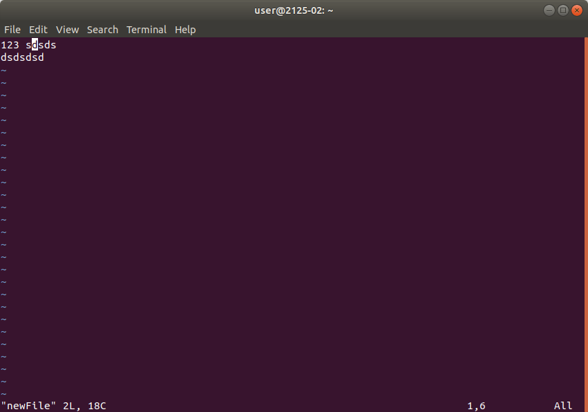

Лабораторна 1: Знайомство з операційною системою Unix (Linux, FreeBSD), реєстрація користувача  
Мета: Познайомити студентів з операційною системою Unix (Linux, FreeBSD) на рівні користувача (робота з файлами і каталогами) та з текстовим редактором vi.

